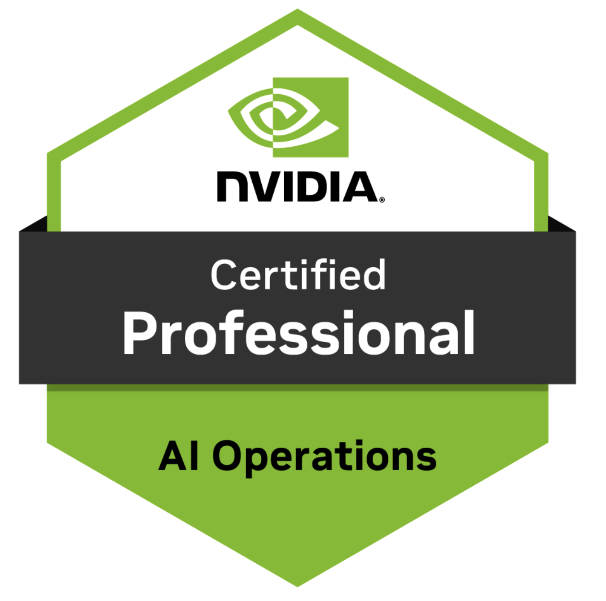

  

---
### 🎓 NVIDIA NCP-AIO Exam Guide  

Hi, I’m **Manjul Solanke**. I have successfully completed the **NVIDIA NCP-AIO certification** ✅  👉 [View Certification](https://www.credly.com/badges/9c49538a-0e37-45c7-a472-35b7c9dafcbc)  

I’m proud to share that I’m among the to achieve this certification 🇮🇳.  

While preparing for the exam, I realized that although NVIDIA provides official training, it’s very costly ($5500 on their website). There are also no dedicated videos or a proper study guide. I personally struggled a lot to gather materials, often piecing them together from scattered sources.  

---
### 📖 About this Guide  
This repository is my attempt to make preparation easier for future aspirants.  
Here, you’ll find structured documentation, curated references, notes, and study materials all in one place.  The goal is simple: to serve as a practical knowledge hub for anyone preparing for the NCP-AIO exam.  

---
### 🎓 NVIDIA Courses & Learning Resources  
All course materials are freely available for self-study(except Coursera). Before going through the exam guide below, I recommend completing these courses, as they provide a solid foundation and cover the essential basics.

| Course | Paid/Free | Comments |
|--------|-----------|----------|
| [infiniband-essentials](https://academy.nvidia.com/en/course/infiniband-essentials/?cm=244) | Free | Good intro to InFiniBand |
| [base-command-manager-administration](https://courses.nvidia.com/courses/course-v1:DLI+S-FX-01+V1/) | Free | Base Command Manager is very important, and typically 4–5 questions in the exam are based on it. |
| [AI Infrastructure and Operations Fundamentals](https://www.coursera.org/learn/ai-infrastructure-operations-fundamentals/home/welcome) | Paid | It’s a Coursera course, more affordable compared to NVIDIA’s offering, but the content is the same. NVIDIA charges around $150|

### Syllabus

The NCP-AI Operations certification is an intermediate-level credential that validates a candidate’s ability to monitor, troubleshoot, and optimize AI infrastructure by NVIDIA. The exam is online and proctored remotely, includes 60-70 questions, and has a 90-minute time limit.

[📘 NVIDIA Certification Study Guide](Books-NCP-AIOP/NCP-AIO-exam-study-guide-ncp-ai-operations.pdf)

### 📝 Exam Domains, Weights & Topics

The table below provides an overview of the topic areas covered in the certification exam and how much of the exam is focused on that subject.  

| Topic Areas                   | % of Exam | Topics Covered |
|--------------------------------|-----------|----------------|
| **Administration**             | 36%       | - Administer Fleet Command   - Administer Slurm cluster   - Understand data center architecture for AI workloads   - Administer Base Command Manager (BCM) and cluster provisioning   - Administer Run.ai (potentially part of ACM)   - Configure MIG (for AI and HPC) |
| **Workload Management**        | 16%       | - Administer Kubernetes cluster   - Use system management tools to troubleshoot issues |
| **Installation and Deployment**| 26%       | - Install and configure BCM   - Install and initialize Kubernetes on NVIDIA hosts using BCM   - Deploy containers from NGC   - Deploy cloud VMI containers   - Understand storage requirements for AI data centers   - Deploy DOCA services on DPU Arm |
| **Troubleshooting & Optimization** | 20%   | - Troubleshoot docker   - Troubleshoot the fabric manager service for NVIDIA NVlink™/NVswitch™ systems   - Troubleshoot BCM   - Troubleshoot Magnum IO components   - Troubleshoot storage performance |

---
### Domains

### Domain 1: Administration
1) Administration tasks for this job include overseeing NVIDIA Fleet Command™ 
2) Slurm clusters
3) Designing data center
4) Architecture specifically for AI workloads, 
5) Managing NVIDIA Run:ai
6) Configuring NVIDIA Multi-Instance GPU (MIG) for both
AI and high-performance computing (HPC) applications.

| Topic | PDF Reference | Useful Links |
|-------|---------------|--------------|
| **1.1 Administer Fleet Command** | [📕 Fleet Command Guide](Books-NCP-AIOP/M1-Administrator/nvidia-fleet-command.pdf) | [Fleet Command 01](https://www.nvidia.com/en-us/edge-computing/?ncid=so-pr-826758#cid=dl23_so-pr_en-us)   [Fleet Command 02](https://nvidianews.nvidia.com/news/nvidia-fleet-command-scales-edge-ai-services-for-enterprises)   [Fleet Command 03](https://blogs.nvidia.com/blog/fleet-command-all-in-one-edge-ai-management/)|
| **1.2 Administer Slurm Clusters** | [📕 Slurm Guide](Books-NCP-AIOP/M1-Administrator/slurm-docs.pdf) | [Slurm 01](https://slurm.schedmd.com/documentation.html)   [Slurm 02](https://ctzn-vishal.github.io/SCRC_Docs/computing-resources/)   [Slurm 03](https://www.carc.usc.edu/user-guides/hpc-systems/using-our-hpc-systems/slurm-templates) |
| **1.3 Design Data Center Architecture for AI Workloads** | [📕Architecture Guide](Books-NCP-AIOP/M1-Administrator/AI-Enterprise-Architecture-Refernce.pdf) | [Architecture for AI](https://docs.nvidia.com/ai-enterprise/planning-resource/ai-factory-white-paper/latest/index.html)   [NVIDIA AI Enterprise](https://docs.nvidia.com/ai-enterprise/deployment/vmware/latest/platform-overview.html)|
| **1.4 Administer Run:ai** | [📕 Run:ai Guide](Books-NCP-AIOP/M1-Administrator/Run-ai-Solution-Overview.pdf) [📕 Run:ai Guide](Books-NCP-AIOP/M1-Administrator/Overview-Run-ai.pdf)| [Run:ai Official Docs](https://run-ai-docs.nvidia.com/) |
| **1.5 Configure MIG for AI and HPC** | [📕 MIG Notes](Reference-Books/MIG.pdf)  [📕 HPC](HPC) | [MIG User Guide](https://docs.nvidia.com/datacenter/tesla/mig-user-guide/) |

---
### Domain 2: Workload Management
1) Administering Kubernetes clusters
2) Troubleshooting issues using system management 
tools like NVIDIA Data Center GPU Manager (DCGM), NVIDIA System Management (NVSM), and nvidia-smi, and 
3) Administering NVIDIA Base Command Manager (BCM) and cluster provisioning. 
4) Resource allocation, monitoring and maintenance of AI infrastructure.

| Topic | PDF Reference | Useful Links |
|-------|---------------|--------------|
| **1.1 Administer Kubernetes cluster** |  | [Kubernetes offical docs ](https://kubernetes.io/docs/concepts/overview/ncid=so-pr-826758#cid=dl23_so-pr_en-us)   [K8s Quick Reference](https://kubernetes.io/docs/reference/kubectl/quick-reference/#scaling-resources) |
| **1.2 Use system management tools such as DCGM, NVSM, and nvidia-smi to troubleshoot issues** | [📕 NVSM](Books-NCP-AIOP/M2-Install-Deploy/nvsm-user-guide.pdf)   [📕 NVSM](Books-NCP-AIOP/M3-Workload-Management/DCGM-Guide.pdf)| [DCGM]([https://slurm.schedmd.com/documentation.html)   [nvidia-smi](https://docs.nvidia.com/deploy/nvidia-smi/index.html](https://docs.nvidia.com/datacenter/dcgm/2.4/user-guide/index.html))   [NVSM](https://docs.nvidia.com/datacenter/nvsm/nvsm-user-guide/latest/introduction.html) |
| **1.3 Administer BCM and cluster provisioning.** | [📕Base Command Platform](Books-NCP-AIOP/M2-Install-Deploy/Base-Command-Platform.pdf)  [📕BCM Installation](Books-NCP-AIOP/M2-Install-Deploy/BCM-Installation.pdf)   [BCM Admin](Books-NCP-AIOP/M2-Install-Deploy/BCM-Admin.pdf)| [BCM](https://docs.nvidia.com/base-command-manager/index.html) |
| **1.4 DeeOPs** | [📕 Run:ai Guide](Books-NCP-AIOP/M1-Administrator/Run-ai-Solution-Overview.pdf) [📕 Run:ai Guide](Books-NCP-AIOP/M1-Administrator/Overview-Run-ai.pdf)| [Run:ai Official Docs](https://run-ai-docs.nvidia.com/) |
| **1.5 DGX BasePod and SuperPod** | [📕 DGX BasePod Deployment](Books-NCP-AIOP/M2-Install-Deploy/DGX-BasePOD-Deployment.pdf)  [📕 DGX BasePod](Books-NCP-AIOP/M2-Install-Deploy/DGX-BasePOD.pdf) | [DGX SuperPod](https://www.nvidia.com/en-us/data-center/dgx-superpod/) |

---
### Domain 3: Install and Deploy

3.1 Install and configure BCM.
3.2 Install and initialize Kubernetes on NVIDIA hosts using BCM.
3.3 Deploy containers from NGC.
3.4 Deploy cloud VMI containers.
3.5 Understand storage requirements for AI data centers.
3.6 Deploy DOCA services on DPU-Arm.

| Topic | PDF Reference | Useful Links |
|-------|---------------|--------------|
| **3.1 Install and configure BCM** | [📕 BCM Install Guide](Books-NCP-AIOP/M2-Install-Deploy/BCM-Installation.pdf)| [NVIDIA Base Command Manager](https://docs.nvidia.com/base-command-manager/) |
| **3.2 Install and initialize Kubernetes on NVIDIA hosts using BCM** |  | [NVIDIA Kubernetes Setup](https://docs.nvidia.com/datacenter/cloud-native/#overview/) |
| **3.3 Deploy containers from NGC** |  | [NVIDIA NGC](https://docs.nvidia.com/ngc/gpu-cloud/ngc-user-guide/index.html) |
| **3.4 Deploy cloud VMI containers** |  | [NVIDIA Cloud Native Docs](https://docs.nvidia.com/ngc/ngc-deploy-public-cloud/ngc-deploy-containers/index.html) |
| **3.5 Understand storage requirements for AI data centers** | [📕 GPUDirect Storage](Books-NCP-AIOP/M4-Troubleshooting-and-Optimization/GPUDirect-Storage-Installation.pdf) | [Storage For AI Infrastructure](https://developer.nvidia.com/blog/choosing-the-right-storage-for-enterprise-ai-workloads/) |
| **3.6 Deploy DOCA services on DPU-Arm** |  | [NVIDIA DOCA Docs](https://docs.nvidia.com/doca/archive/2-5-2/index.html) |

---
### Domain 4: Troubleshooting and Optimization

4.1 Troubleshoot Docker.
4.2 Troubleshoot the fabric manager service for NVLink and NVSwitch systems.
4.3 Troubleshoot Base Command Manager.
4.4 Troubleshoot Magnum IO components.
4.5 Troubleshoot storage performance.

| Topic | PDF Reference | Useful Links |
|-------|---------------|--------------|
| **4.1 Troubleshoot Docker** | | [NVIDIA Base Command Manager](https://docs.nvidia.com/base-command-manager/) |
| **4.2 fabric manager, NVLink and NVSwithch** | [📕Fabric Manager User Guide ](Books-NCP-AIOP/M4-Troubleshooting-and-Optimization/fabric-manager-user-guide.pdf) | [NVIDIA Kubernetes Setup](https://docs.nvidia.com/datacenter/cloud-native/#overview/) |
| **4.3 Deploy containers from NGC** |  | [NVIDIA NGC](https://docs.nvidia.com/ngc/gpu-cloud/ngc-user-guide/index.html) |
| **4.4 Magnum IO** |  | [NVIDIA Cloud Native Docs](https://www.nvidia.com/en-us/data-center/magnum-io/?srsltid=AfmBOoonoYiFIbBEJ9cULW79R1nLhQyL83DOkEpzGzphgU15K4Sp2RpG) |
| **4.5 storage performance** | [📕 GPUDirect Storage](Books-NCP-AIOP/M4-Troubleshooting-and-Optimization/GPUDirect-Storage-Installation.pdf) | [Storage For AI Infrastructure](https://developer.nvidia.com/blog/choosing-the-right-storage-for-enterprise-ai-workloads/) |
| **3.6 Deploy DOCA services on DPU-Arm and UFM** |  | [NVIDIA DOCA Docs](https://docs.nvidia.com/doca/archive/2-5-2/index.html)   [UFM](https://docs.nvidia.com/networking/display/ufmenterpriseqsgv6121/upgrading+ufm+software)|

---
### 🚨 Important Exam Points (Must-know Topics)  

These are the high-priority areas you **cannot afford to miss** for the NCP-AIO exam:  

- **Kubernetes & Docker** → Working knowledge required. Expect 5–6 questions.  
  - Topics: Pod placement mechanisms, GPU Operator, Docker toolkits, K8s troubleshooting.  
- **Base Command Manager (BCM)** → Expect 5–6 questions.  
  - Topics: User management, deployments, troubleshooting.  
- **Slurm** → Very important.  
  - Topics: Job scheduling, partitions, configuration files, troubleshooting.  
- **Run:ai** → Expect 2–3 questions.  
- **nvidia-smi, DCGM, NVSM** → Critical for monitoring & troubleshooting.  
- **DOCA & UFM** → Key infrastructure topics.  
- **Fabric Manager, NVLink, NVSwitch** → High relevance for troubleshooting.  

---
### 📚 Additional Resource  
- [Udemy – Certified Professional AI Operations Exam Question Bank](https://www.udemy.com/course/certified-professional-ai-operations-exams/?couponCode=LETSLEARNNOW) → Useful for basic understanding of exam-style questions.  

---
### ⚠️ Disclaimer  

This repository and its contents have been created to the best of my knowledge and personal experience while preparing for the NVIDIA NCP-AIO certification.  

- This is not an official NVIDIA study guide.  
- The official exam study guide provided by NVIDIA is the best and primary source of truth for exam preparation.  

If you find errors or have better references, feel free to suggest improvements. PRs are always welcome 🙂

